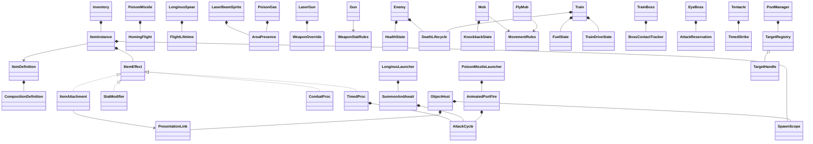

# Runtime composition comparison and evidence

This is an implementation comparison on `codex/runtime-composition`, based on `lovetrain2` at `95a7d5e`. It covers item, attack, projectile, monster/boss and player runtime responsibilities. Existing Unity authoring adapters and asset contracts remain in place.

## Actual structure

Parts are instantiated and used by the existing adapters. `ObjectHost` is a local C# binding object, not a new MonoBehaviour base or a persistent/global Manager. Existing `IWeaponStrategy`, item identity, save keys and authoring fields are retained.

## Comparison

The measured source set is LeeJunmo and SangHyup script folders, root `Assets/*.cs` and `Assets/Editor/*.cs`. It excludes Steamworks/DOTween vendor code, generated code and these validation fixtures.

| Metric | Baseline | Branch |
| --- | ---: | ---: |
| C# files | 148 | 177 |
| Class declarations | 167 | 196 |
| Source lines, including comments/blank lines, normalized EOF | 18,482 | 18,693 |
| Raw Enemy/Mob/Boss GetComponent pattern occurrences | 15 | 6 |

Counts are source metrics, not a performance or runtime coupling measurement. The pattern count can include comments. Existing inheritance/adapter files are deliberately retained, so this branch currently adds 29 C# files rather than deleting the old classes. A final file-count reduction depends on an approved asset/type migration.

Final static audit: all 177 measured source files match the native validation copy by SHA256; 217 existing authoring field declarations are preserved; 3,023 asset GUIDs are unique; existing asset/settings changes are zero. The source line count grew by 211 despite distributing responsibilities into 29 additional files.

Functional differences in structure:

- Thirteen SO authoring types now supply shared definitions and actual effect factories; runtime state belongs to ItemInstance/effects or attached attack parts.
- Equipment applies, upgrades and releases the same stat lease/attachment/proc/timer roles.
- SummonAndAwait and AnimatedPortFire share timer storage while preserving different clocks, emission counts and completion rules.
- Flight, area contacts/ticks, health/fuel, death, contact constraints and attack reservations have explicit owners.
- Consumers request target capabilities; the remaining Enemy/Mob/Boss resolution is concentrated in compatibility/construction boundaries and the disabled legacy Bullet path.

## Validation

`CompositionValidation.cs` and `CompositionOwnedProbe.cs` are validation-only sources copied into an isolated Unity 6000.2.3f1 project. They are outside the production Assets tree. The temporary project uses a different company/product name and an empty scene; it does not read or write the original permanent-upgrade profile.

Initial execution: [45 checks, no failures](native-initial-results.json).
Expanded execution: [60 checks, no failures](native-expanded-results.json).
Final execution: [63 checks, no failures](native-final-results.json), with zero C# compiler errors and the isolated Editor exited. All existing Editor scripts were included in this final compilation. Cross review also found and repaired the known Heart/Bible virtual-hook dispatch boundary and the attachment-release/deferred-Destroy callback window; dedicated native checks cover both.

[Exact source snapshot](source-snapshot.json), [static audit](static-audit.json) and [measured metrics](comparison-metrics.json) are reproducible with `Audit-Composition.ps1`. Raw `.log` files are retained locally and ignored by Git; the checked-in JSON and fixture sources carry the portable evidence.

Checks cover actual compiled parts, all 13 recipe construction paths, public virtual hooks, stat reversal, same-frame vs next-frame readiness, manual restart/mirrors, native target resolution/destroyed-object semantics, actual spear expiry, independent missile movement, gas animation activation, area cadence and scope cleanup/callback invalidation. This is not a complete production-scene or visual combat test.

Original scenes/prefabs/SO assets, existing .meta/GUIDs, settings, packages and stored enum values are checked independently by source/Git inspection. Source files copied into the isolated project are hashed against the branch.

Not executed: original Editor import/Play Mode, full Junmo combat and animation clips, all boss encounters, OS keyboard/mouse/resolution interactions, a complete run and player build. Compilation/native component checks do not imply those checks passed.

The isolated initial import can emit render-settings/sample warnings because production render assets are not copied. It is not rendering evidence. Preserve logs as diagnostics; do not treat the licensing refresh warning as a compile failure when the licensed Editor completed its run.

## Reproduction

Copy the branch's runtime sources, existing Editor sources, required vendor code/packages/settings into a disposable validation project. Change only the copy's company/product name, add the two validation fixture files under its Assets/Editor and Assets respectively, then run the installed 6000.2.3f1 Editor in batch mode with `LoveTrainCompositionValidation.Runner.Execute`. Do not run a second batch Editor against the original open project. The runner enters native Play Mode in an empty scene, writes `composition-results.json`, exits Play Mode and exits the isolated Editor.

`validation-project.txt` records the local temporary path, not a required project dependency. Final logs and results are retained here; the local Temp project is expendable.
